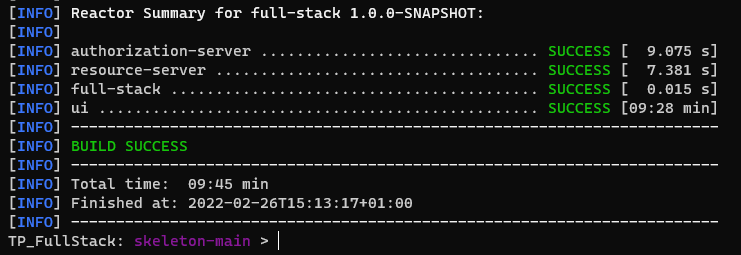

## TP Full-Stack

- Morin Florian
- Ptit Haddad Raphaël
- Zatout Mohamed Redha


Procédure de test:
- Étapes pour build et run les applications


<br>A partir du dossier skeleton-main, executer :
```
sudo mvn clean install
```


Ceci devrais donner le résultat suivant : 



Ainsi nous aurons les éléments suivants :


Pour lancer l'application nous pouvons lancer la commande :

`sudo mvn -f authorization-server/ spring-boot:run & sudo mvn -f resource-server/ spring-boot:run & sudo npm start --prefix ui/src/main/resources/ &`
 et attendre que ceci s'affiche :

Pour arrêter les 3 parties du TP nous pouvons exécuter cette commande : 
`{ sudo lsof  -i :8083 | grep LISTEN && sudo lsof -i :8081 |grep LISTEN && sudo ps aux | grep -i "ng serve " ;} |awk {'print $2'} |sudo xargs kill -9`
qui produire ce type d'erreur :
Cependant nous avons besoin des 3 parties du TP active pour les prochaines étapes.

Nous avons donc normalement 2 adresses différentes disponibles:
http://localhost:8083/auth/ et http://localhost:8089/ qui correspondent respectivement à la console d'administration et à l'accès utilisateur

- Étapes pour créer un utilisateur

  Afin de créer utilisateur nous devons d'abord nous connecter à la session administration sur l'adresse : http://localhost:8083/auth/ avec comme utilisateur :"bael-admin" et comme mot de passe "SuperMdp"

Puis dans la console on va Users puis nous ajoutons un nouvel utilisateur:

Ensuite nous entrons les informations relative à celui-ci:


De plus nous ajoutons son mot de passe:


Quand nous nous connectons nous devons alors définir notre propre mot de passe:


Une fois un mot de passe entrée, nous pouvons nous connecter :


- Étapes pour accéder au front et se connecter

    Pour se connecter au front nous allons sur l'adresse : http://localhost:8089/ où nous rentrons les informations de notre utilisateur à savoir "superutilisateur" et pass2 que nous avons configuré précedemment
    Nous pouvons aussi nous connecter avec un utlisateur par défaut à savoir "mike@other.com" et "pass"


- Étapes pour tester la lecture et la création de ressources
    
    Pour ajouter une ressource nous rajoutons une entrée dans le fichier data.sql dans resource-server/src/main/resources/
    
    De plus nous avons fais en sorte que lorsque l'utlisateur demande un nouveau foo il recevra un foo aléatoire compris dans [1;4]
    
    Cette demande se fais à l'adresse http://localhost:8089/ avec un utilisateur par défaut par exemple